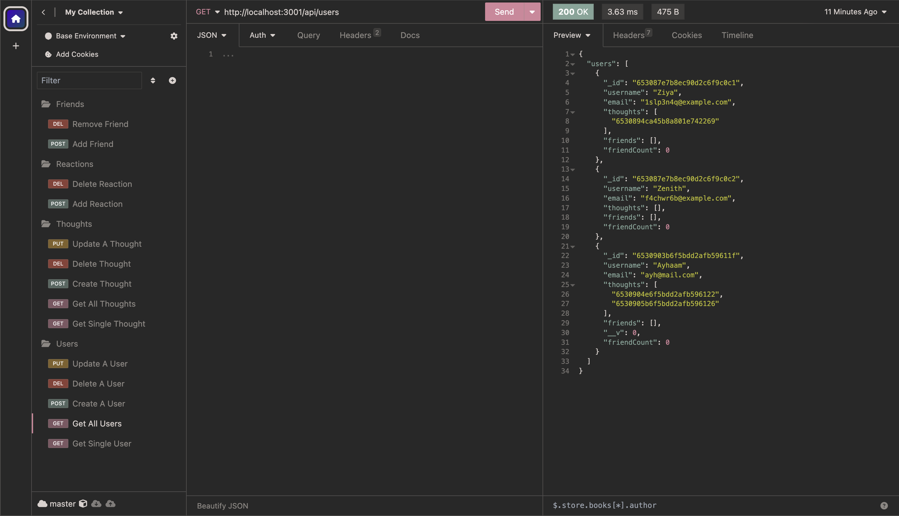

# social-network-api
A back end application allowing you to perform CRUD operations on a database!

## Description
See a collection of users with their associated thoughts that can be updated, deleted, created and viewed! Thoughts also have reactions that can be created and removed and users have friends that can be added or removed!

## Executing program
Website link: https://github.com/AyhaamB/social-network-api

## Screenshot of Program

## How to video
https://drive.google.com/file/d/1qu_MQ6EVr01cA_D814r-xgbP5Rc4Mdsq/view?usp=sharing

## Help
Any advice for common problems or issues, email me at ayh132@gmail.com

## Authors
Ayhaam Baksh - Github: https://github.com/AyhaamB